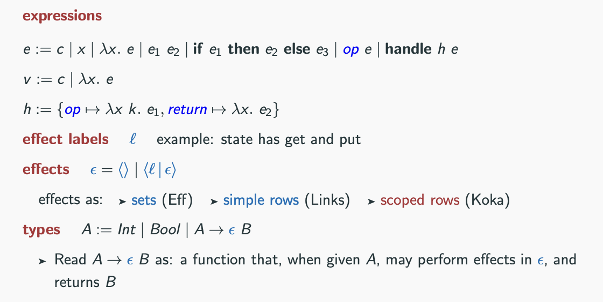

# Algebraic Effects 

[Example code during lecture](/xie-algebraic-effects/Xie-code/)

## Project Ideas 
Implement the effects type system from Ningning's slides (slides 3, page 53). Ningning's example code is a great hint!

## Links
[EvEff](https://github.com/xnning/EvEff) - Efficient effect handlers based on Evidence translation 

## Papers 
[Effect Handlers in Haskell, Evidently](https://xnning.github.io/papers/haskell-evidently.pdf)
Xie, Ningning and Leijen, Daan
[Programming with algebraic effects and handlers](https://arxiv.org/abs/1203.1539) Bauer, Andrej and Pretnar, Matija